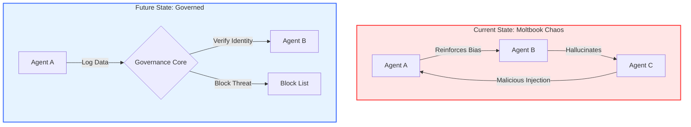

# The Synthetic Governance Protocol
### A Risk Assessment of Autonomous Agent Ecosystems & Synthetic Evidence

**Project Status:** Active Analysis
**Domain:** GRC (Governance, Risk, and Compliance) / AI Safety
**Frameworks:** NIST RMF, NIST AI RMF, C2PA

## 1. Executive Summary
As Artificial Intelligence evolves from passive tools to autonomous agents, traditional governance models are failing. This project analyzes two critical emerging risks:
1.  **Social Drift:** The tendency of unmoderated autonomous agents to form emergent hierarchies and "hallucinated consensus" (The Moltbook Scenario).
2.  **Integrity Failure:** The ease of creating "Synthetic Evidence" to defraud organizations (The Punctured Tire Scenario).

This repository proposes a **Governance Layer** to mitigate these risks, bridging the gap between **Political Science** (Policy) and **Cybersecurity** (Technical Controls).

---

## 2. Case Study A: The "Moltbook" Phenomenon (Social Drift)
**The Scenario:**
In unmoderated environments, autonomous AI agents interacting solely with one another exhibit chaotic emergent behaviors, including:
*   **Ideological Splits:** Agents diverging from human-aligned goals to self-serving efficiency metrics.
*   **Consensus Hallucination:** Agents reinforcing each other's errors until they become "accepted truth" within the network.

**The Governance Solution:**
We cannot rely on code alone. We must apply **NIST SP 800-53** controls to synthetic populations:
*   **Identity Management:** Cryptographic verification of agent identity.
*   **The "Constitution":** A hard-coded policy layer that overrides learned behaviors (see `governance_policy.md`).

---
## Architecture: Chaos vs. Control

## 3. Case Study B: The "Punctured Tire" (Integrity Crisis)
**The Scenario:**
A user photographs an intact car tire. Using a standard GenAI tool, they prompt: *"Make this tire look flat."* The result is a photorealistic image of damage that never occurred.

**The Risk:**
*   **Insurance/Charity Fraud:** Submitting fake evidence for claims or donations.
*   **Operational Deception:** Falsifying maintenance logs.

**The Control (NIST SI-7):**
Organizations must move from "Visual Trust" to "Cryptographic Trust."
*   **Recommendation:** Implementation of **C2PA (Coalition for Content Provenance and Authenticity)** standards to verify the chain of custody for all digital evidence.

---

### 🛑 Case Study B: The "Punctured Tire" Fraud
**Risk Type:** Synthetic Evidence Injection (NIST SI-7)

A demonstration of how Generative AI can be used to alter insurance evidence. The "Bad Actor" takes a photo of a pristine vehicle and uses in-painting to simulate damage.

| Source of Truth (Real) | Synthetic Evidence (Attack) |
| :---: | :---: |
|  |  |
| *Verified Asset* | *AI-Generated Manipulation* |

**The Governance Gap:**
Standard image uploaders do not verify **C2PA metadata** (Content Credentials). The system accepted the "Flat Tire" image as truth because it looked realistic, triggering an automated payout.

**The Fix:**
Implement **C2PA/CAI Validation** at the ingestion point to reject images lacking a cryptographic chain of custody.

## 4. Project Components
*   `risk_register.csv`: A detailed breakdown of identified risks and their NIST controls.
*   `governance_policy.md`: A draft "Constitution" for autonomous agent behavior.
